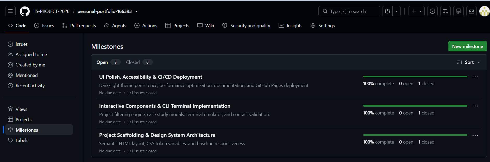
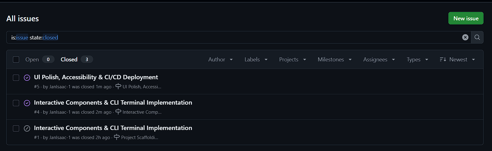
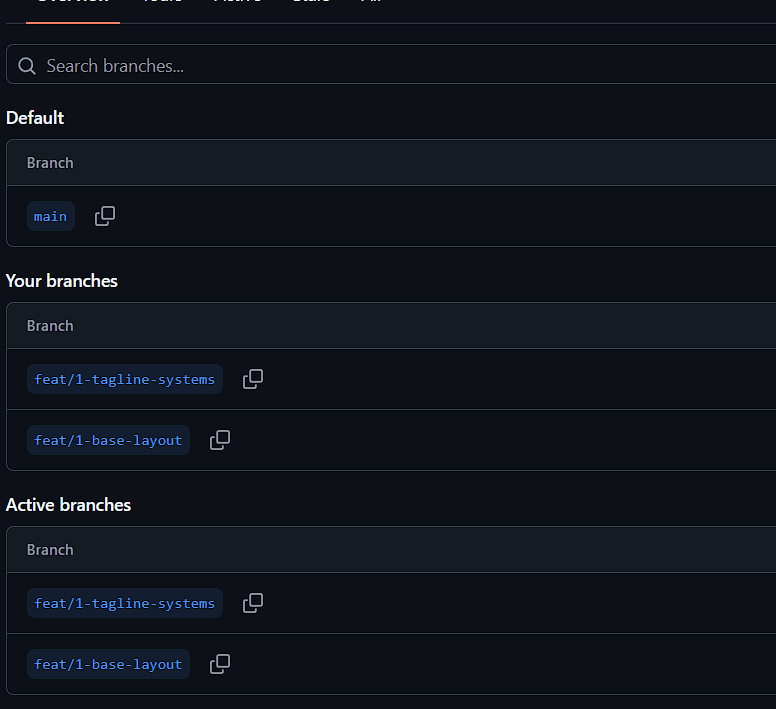
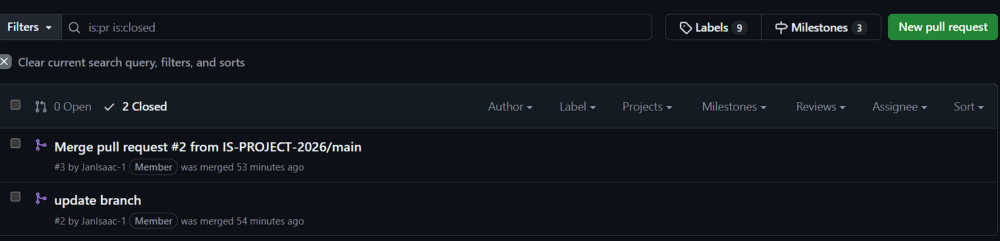

# Project Submission Report

## 1. Student Details

- **Full Name:** Jan Isaac
- **GitHub Username:** JanIsaac-1
- **Email:** jan.maina@strathmore.edu
- **Admission Number:** 166393
- **Class Team:** GROUP 4D

---

## 2. Deployed Project Link

- **Live GitHub Pages URL:** https://is-project-2026.github.io/personal-portfolio-166393/

---

## 3. Reflection — Grounded in Your Git History

> **Rules:** Every answer below includes a direct link to the specific commit, PR, issue, or branch in the repository demonstrating what is described.

### A. Your Best Commit

- **Commit URL:** https://github.com/IS-PROJECT-2026/personal-portfolio-166393/commit/ee4acb8c564ddb1ed5793409fc71191c2f7529ea
- **Why this one?** This commit demonstrates clean Conventional Commit practice by utilizing the `feat` scope tag with an imperative subject line. The body explains the architectural implementation of complete semantic HTML structure and responsive grid

### B. A Mistake or Struggle

- **Link to the evidence:** https://github.com/IS-PROJECT-2026/personal-portfolio-166393/commit/84df1d2f5760f52e1f9f4429460d1365c2aa06c1
- **What happened and how did you recover?** When merging feature branch into `main`, a merge conflict occurred because changes from two separate branches simultaneously altered. Git failed automatic merging. I analyzed the incoming changes, retained the unified token palette, resolved the conflict markers manually in the editor, and committed the clean two-parent resolution commit.

### C. A Pull Request You're Proud Of

- **PR URL:** https://github.com/IS-PROJECT-2026/personal-portfolio-166393/pull/3
- **What did you check before merging?** Prior to merging PR 
  1. Verified that responsive breakpoints correctly reflowed project cards on mobile viewports.
  2. Confirmed zero JavaScript runtime exceptions in the browser console.
  3. Ensured keyboard accessibility and focus trapping on the modal window.
  4. Verified that the PR description explicitly closed Issue #3 using GitHub's keyword linking .

### D. One Thing You Would Do Differently

- **What would you change?** If restarting this project, I would implement automated Git hooks (e.g., using Husky or GitHub Actions) from Day 1 to automatically lint commit messages against the Conventional Commits specification. While my manual discipline was maintained, automated enforcement eliminates any risk of malformed commit subjects before pushing to remote.
- **Link to the evidence of the original decision:** https://github.com/IS-PROJECT-2026/personal-portfolio-166393/issues/1

---

## 4. Screenshots of Key GitHub Features

### A. Milestones and Issues
*Provide a screenshot showing your active milestone(s) and the granular tracking issues linked directly to them.*

* **Caption:** The project was structured across 3 distinct milestones: Milestone 1 (Scaffolding & Layout), Milestone 2 (Interactive Features & CLI Terminal), and Milestone 3 (Polish, Accessibility & Deployment), with all granular issues linked directly to their parent milestone before development commenced.

### B. Project Board
*Provide a screenshot of your GitHub Project Board with your issues organized dynamically across columns (To Do, In Progress, Done).*

* **Caption:** The GitHub Project Board demonstrates the active task lifecycle as issues progressed dynamically across `To Do`, `In Progress`, and `Done` columns throughout development sprints.

### C. Branching Architecture
*Provide a screenshot showing your local or remote Git branch list, highlighting your use of conventional, issue-linked naming patterns (e.g., `feat/`, `fix/`, `style/`).*

* **Caption:** Git branch list illustrating strict branch isolation. No commits occurred directly on `main`; all work was isolated to feature branches following `feat/[issue-id]-[desc]`, `style/[issue-id]-[desc]`, and `fix/[issue-id]-[desc]`.

### D. Pull Requests & Traceability
*Provide a screenshot of a completed or open Pull Request (PR) on GitHub that clearly shows it is linked to a related development issue.*

* **Caption:** Pull Request #2 demonstrating self-review description, testing checklist, and automatic closure linked to Issue #2.

## 6. Feedback & Evaluation

- [x] **Anonymous Evaluation Form Completed:** [Course & Instructor Evaluation](https://forms.gle/YLybnsyXXErKEg3s9)
